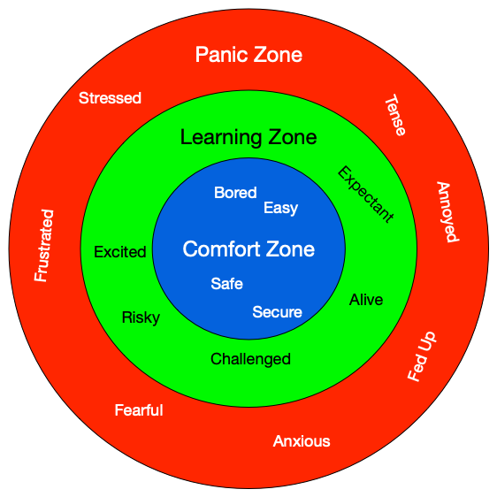

Preface
=======

Welcome to #EssenceOfComputing! In this course, we'll use the web (specifically HTML, CSS, and JavaScript) as a vehicle to explore fundamental concepts and important skills in computing, from data representation (all those ones and zeros you may have heard about) to programming.

Instead of assuming you have a significant background in programming, networking, or any other areas of computing, we start from the very basic ideas and terms, and build up from there. The only knowledge you are assumed to have is basic computer use--browsing and search on the web, email, moving files around. If there are terms or concepts presented here that you are not familiar with, please alert me so I can add appropriate explanations. You can play a role in improving this course for yourself and others!

This book draws from several sources. The primary one is a free online book called Fundamentals of Web Programming (webfundamentals) by Brad Miller at Runestone Interactive, but it includes material from other Runestone Interactive books, as well as various articles, blog posts, and websites (credited on individual pages).

The Content and Structure of this Book
--------------------------------------

The projects in this book require you to learn:

* Linux (command line)
* WordPress
* HTML
* CSS
* Javascript

Any of these would be enough for a single course!  In fact, we have other courses that will go into more depth on several of these topics.

So, I am going to ask you to do things that are not explicitly covered in the book.  I may not lecture on them. If you just want to regurgitate what is in lecture you won't learn much, and the knowledge you gained would be obsolete in a year or so anyway.  In this book what I hope to emphasize is the **context**, the **background** and the  **essentials** that will equip you to find the details you need on your own.

What I mean by context and background includes answering questions like:

* What is a markup language and what should you expect from a good one?  This will arm you to find the specific tag you need to do the job you want rather than asking you to memorize all of the tags in the html language.
* How does a typical web application work?  Including a little bit about how the internet itself operates so that you will see the logic behind how the browser and the web server work together and communicate with each other at different levels.

If this book was a reference manual for HTML, Javascript, etc. it would be hundreds of thousands of pages long, and it would be horrible.  There are great dedicated resources for all of them.  This course is about how we integrate them.

Learning Zones
--------------

I'm a big believer in the Learning Zone concept, and in this class I want you to be in the learning zone. In class, when you are working on projects, or listening to a lecture you are not being judged.  This is the time to make crazy mistakes and ask questions that might seem stupid.  You **should** feel challenged as we work on solving problems and developing solutions tegether. you **should not** feel like the solution will just flow from the depths of your brain to your finger tips like so much water flowing down stream.  Programming is hard work and to the extent your instructor makes it look easy while standing in front of you, that is part of the performance of teaching and not the reality of the doing.

From time to time you will be asked to respond to a poll about what zone you were in on a particular day.

There is a second definition of the learning zone that is related to what we have been talking aobut.  In this amazing `TED talk: How to get better at the things you care about <https://www.ted.com/talks/eduardo_briceno_how_to_get_better_at_the_things_you_care_about>`_ Eduardo Briceño talks about the "performance zone" versus the "learning zone."

.. youtube:: YKACzIrog24

The big takeaway for you is that as a student in the classroom for this class, you are in the learning zone as Briceño defines it.  You are not being judged or graded for how quickly you arrive at an answer or not!  The classroom for this course is a time for you to practice old skills, try new skills, and to fail without repercussions.  That is how we learn!  You will spend a huge amount of the rest of your life in the performance zone, so take advantage of this opportunity and enjoy the chance to be in the learning zone.

Prof. Robert Ordóñez ("Prof. O")
August 2020
